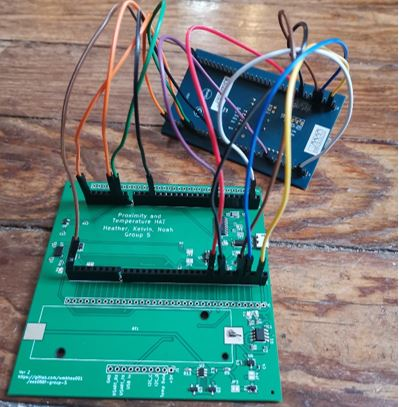
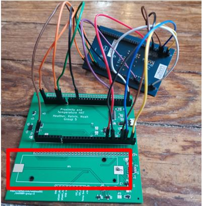
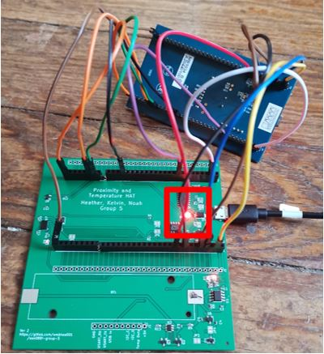
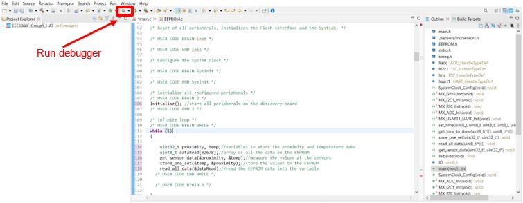
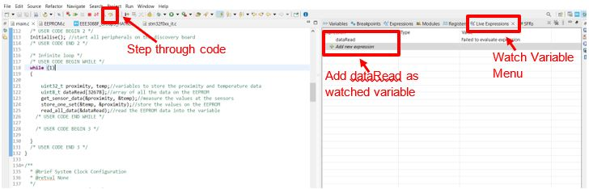

# EEE088F Group 5

A HAT design to be added to the STM32 microcontroller.

## Proximity and Temperature Sensing HAT

Our HAT will include a temperature and proximity sensor. These sensors will allow for our HAT to provide the device it is attached to with useful parameters of its environment. The device we will be attaching our HAT to is the STM32 Discovery Microcontroller. The scenario we would use our HAT in would be to create efficient water dispensers. The proximity sensor will be able to detect when a bottle/hand is in position to receive water and the temperature sensor will help to monitor the water’s temperature. Other scenarios our HAT could be used in include drones, cars and automatic sliding doors

## Contents
This repo contains all files needed to understand the functionality of the HAT as well as have the HAT built. A description of the folder contents can be found below:

* [CAD](https://gitlab.com/wmbhea001/eee088f-group-5/-/tree/main/CAD) - Models and designs associated with the project

* [Docs](https://gitlab.com/wmbhea001/eee088f-group-5/-/tree/main/Docs) - Documentation which may include schematics, datasheets and manuals

* [Firmware](https://gitlab.com/wmbhea001/eee088f-group-5/-/tree/main/Firmware) - Source code for the HAT's software interface. 

* [PCB](https://gitlab.com/wmbhea001/eee088f-group-5/-/tree/main/PCB) - Contains PCB schematic diagrams 

* [Production](https://gitlab.com/wmbhea001/eee088f-group-5/-/tree/main/Production) - Documents relating to cost of HAT and production of HAT

* [Simulation](https://gitlab.com/wmbhea001/eee088f-group-5/-/tree/main/PCB/Simulation) - Contains documents neccessary for the fabrication of the HAT

## Get started with Proximity and Temperature HAT

### Introduction 
In the guide below, the process of how to set-up and run the Proximity and Temperature HAT will be described. The HAT is intended to be attached to and powered by a STM32 Discovery Board and powered by an 18650 battery when the STM is not connected to an external device via USB. It is able to store data in memory and in future versions provide this data to the USB-connected device.

### What you will need
Hardware:
-STM Discovery Board
-USB mini-B
-Female Pin-Headers (ver 1)
-Male-Female Wires (ver 1)
-USB micro-B
-18650 Battery (optional)
-18650 Battery Holder (optional)
Software:
-STM32CubeIDE

### Setup
1.	Plug the STM discovery board into the HAT with both USBs on the same side (pin headers and wires are used in the original version to account for the footprint issue).
*Figure 1: STM32F051 Discovery Board connected to Proximity and Temperature HAT (version 1 with wires)*
 
Figure 1: STM32F051 Discovery Board connected to Proximity and Temperature HAT (version 1 with wires)

2.	Connect the HAT to a power source either
-Clip the 18650 battery holder to the connection shown below and place the battery in the holder (the lights on the discovery board should turn on)
*Figure 2: Location to plug in battery holder*

OR

- Plug the HAT into a USB power source using the USB micro-B which will turn on the light D4
*Figure 3: HAT powered by USB connection with USB detect light on*

3.	Plug the STM discovery board into your computer used for coding using the USB mini-B

4.	Open the firmwave files in the CubeIDE application. Add the following code to the main.c file in the section called int main(void). This serves as the main section to add code to interface with the HAT
 
```c
int main(void)
{
  Initialise(); //start all peripherals on the discovery board

  while (1)
  {
    uint32_t proximity, temp;//variables to store the proximity and temperature data
	  uint8_t dataRead[32678];//array of all the data on the EEPROM
	  get_sensor_data(&proximity, &temp);//measure the values at the sensors
	  store_one_set(&temp, &proximity);//store the values on the EEPROM
	  read_all_data(&dataRead);//read the EEPROM data into the variable 
  }
}
```

5.	Run a debug in the CubeIDE and add a watch to the dataRead variable. Stepping through the code will allow you to observe the changes in the EEPROM (future versions of the HAT will display this directly to an interface)

*Figure 4: Run the debugger from the CubeIDE*

*Figure 5: Add dataRead as a watched variable and step through the code*

Congratulations! You now have a HAT for your STM32 discovery board that can measure temperature and proximity.


## Support
Any questions concerning the project can be addressed to the project developers at wmbhea001@myuct.ac.za; ynkkel001@myuct.ac.za or; hvknoa001@myuct.ac.za

## Contributing
Please refer to [Contributing.md](https://gitlab.com/wmbhea001/eee088f-group-5/-/blob/main/CONTRIBUTING.md) for more information

## Authors and acknowledgment
Project designers are Kelvin Yankey, Heather Wimberley and Noah Havik.

## License
Open Source Project as long as creators are linked.

## Project status
Project is currently under development.
